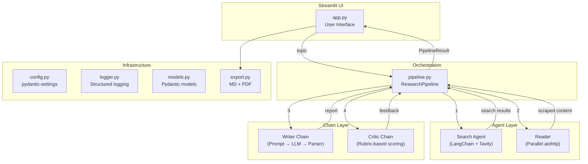

<div align="center">

# 🔬 ResearchMind

### Multi-Agent AI Research System

[](https://python.org)
[](https://langchain.com)
[](https://streamlit.io)
[](https://groq.com)
[](LICENSE)

> Four AI agents collaborate — searching, scraping, writing, and critiquing — to deliver polished research reports on any topic.

[Features](#-features) · [Architecture](#-architecture) · [Quick Start](#-quick-start) · [Tech Stack](#-tech-stack) · [Roadmap](#-roadmap)

</div>

---

## ✨ Features

- **🤖 Multi-Agent Pipeline** — Four specialized agents (Search → Read → Write → Critique) work in sequence
- **🔍 Web Search** — Tavily-powered search finds recent, authoritative sources
- **📄 Parallel Scraping** — Scrapes top 3 URLs concurrently with aiohttp for richer context
- **✍️ Report Generation** — LLM drafts structured reports with citations and analysis
- **🧐 Automated Critique** — Reports are scored on a 5-criteria rubric (Accuracy, Completeness, Structure, Depth, Sources)
- **⚡ Retry Logic** — Tenacity-based retries with exponential backoff on all API calls
- **💾 Smart Caching** — Disk cache with TTL avoids redundant API calls
- **🔒 Security** — URL validation (SSRF prevention), XSS protection, prompt injection defense
- **📥 Export** — Download reports as Markdown or styled PDF
- **🎨 Dark UI** — Professional Streamlit interface with custom glassmorphism design

---

## 🏗 Architecture



### Data Flow

```
User enters topic
    │
    ▼
┌─────────────────────┐
│  1. Search Agent     │ → Tavily API → SearchResults
└─────────────────────┘
    │
    ▼
┌─────────────────────┐
│  2. Parallel Scrape  │ → aiohttp × 3 URLs → ScrapedResults
└─────────────────────┘
    │
    ▼
┌─────────────────────┐
│  3. Writer Chain     │ → Groq LLM → ResearchReport
└─────────────────────┘
    │
    ▼
┌─────────────────────┐
│  4. Critic Chain     │ → Groq LLM → CriticFeedback (scored)
└─────────────────────┘
    │
    ▼
Results displayed + Export (MD / PDF)
```

---

## 🚀 Quick Start

### Prerequisites

- Python 3.11+
- [Groq API key](https://console.groq.com/keys) (free tier available)
- [Tavily API key](https://app.tavily.com/home) (free tier: 1000 searches/month)

### Installation

```bash
# Clone the repository
git clone https://github.com/your-username/multi-agent-research-system.git
cd multi-agent-research-system

# Install dependencies (using uv — recommended)
uv sync

# Or with pip
pip install -r requirements.txt

# Configure environment
cp .env.example .env
# Edit .env and add your API keys
```

### Run

```bash
# Streamlit UI (recommended)
uv run streamlit run app.py

# CLI mode
uv run python pipeline.py
```

### Run Tests

```bash
uv run pytest tests/ -v
```

---

## 📸 Screenshots

<!-- Add screenshots of your running app here -->
<!--  -->
<!--  -->

*Screenshots coming soon — run the app locally to see the UI!*

---

## 📁 Project Structure

```
multi-agent-research-system/
├── app.py              # Streamlit UI (presentation only)
├── pipeline.py         # ResearchPipeline orchestration (business logic)
├── agents.py           # LangChain agents + LCEL chains
├── tools.py            # Web search + URL scraping tools
├── models.py           # Pydantic data models
├── config.py           # pydantic-settings configuration
├── logger.py           # Centralized logging
├── exceptions.py       # Custom exception hierarchy
├── export.py           # Markdown + PDF export
├── static/
│   └── style.css       # Custom dark theme CSS
├── tests/
│   ├── conftest.py     # Shared test fixtures
│   ├── test_config.py  # Configuration tests
│   ├── test_tools.py   # Tool tests (mocked APIs)
│   ├── test_pipeline.py# Pipeline tests
│   ├── test_models.py  # Model validation tests
│   └── test_export.py  # Export tests
├── .env.example        # Environment template
├── pyproject.toml      # Project config + dependencies
├── requirements.txt    # pip-compatible requirements
└── README.md           # You are here
```

---

## 🛠 Tech Stack

| Layer | Technology | Purpose |
|-------|-----------|---------|
| **LLM** | Groq (LLaMA 3.1 8B) | Fast inference for report generation |
| **Agent Framework** | LangChain `create_agent` | ReAct agent loop with tools |
| **Search** | Tavily | Web search with relevance ranking |
| **Scraping** | aiohttp + BeautifulSoup | Parallel URL fetching + HTML parsing |
| **UI** | Streamlit | Interactive web interface |
| **Validation** | Pydantic | Structured data models |
| **Config** | pydantic-settings | Type-safe environment config |
| **Retry** | Tenacity | Exponential backoff on failures |
| **Caching** | diskcache | TTL-based result caching |
| **Export** | fpdf2 | PDF report generation |
| **Logging** | Python logging | Structured console + file logs |
| **Testing** | pytest | Unit tests with mocked APIs |

---

## ⚙️ Configuration

All settings are configurable via environment variables. See [`.env.example`](.env.example) for the full list.

| Variable | Default | Description |
|----------|---------|-------------|
| `GROQ_API_KEY` | *required* | Groq API key |
| `TAVILY_API_KEY` | *required* | Tavily search API key |
| `MODEL_NAME` | `llama-3.1-8b-instant` | Groq model identifier |
| `SCRAPE_PARALLEL_COUNT` | `3` | URLs to scrape in parallel |
| `CACHE_ENABLED` | `true` | Enable disk caching |

---

## 🗺 Roadmap

### Completed ✅
- [x] Multi-agent pipeline (Search → Read → Write → Critique)
- [x] Beautiful dark-mode Streamlit UI
- [x] Parallel URL scraping with aiohttp
- [x] Pydantic structured outputs
- [x] Retry logic with tenacity
- [x] Disk caching with TTL
- [x] Markdown + PDF export
- [x] Production-grade error handling
- [x] Centralized logging
- [x] Security hardening (XSS, SSRF, prompt injection)

### Planned 🚧
- [ ] LangGraph state machine with conditional edges
- [ ] Streaming responses (token-by-token)
- [ ] Human-in-the-loop review step
- [ ] LangSmith tracing integration
- [ ] Docker deployment
- [ ] CI/CD with GitHub Actions
- [ ] FastAPI backend + REST API
- [ ] PostgreSQL for research history
- [ ] Authentication (OAuth2)

---

## 📝 License

This project is licensed under the MIT License.

---

<div align="center">

**Built with ❤️ using LangChain, Groq, and Streamlit**

</div>
